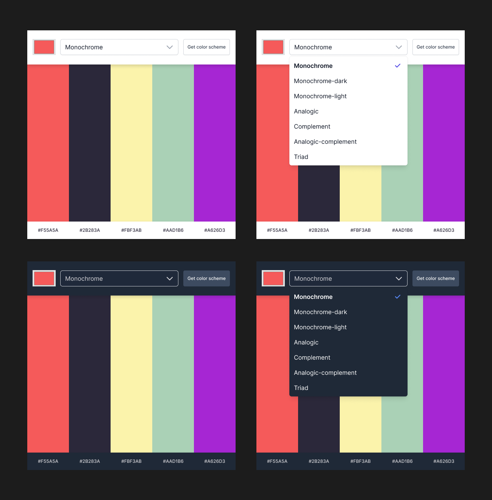

# scrimba-colors
Color scheme generator for Scrimba's Front End Course

## Design

## Requirements
- Use Color Input and dropdown so user can select a color and a scheme type
- When 'Get color scheme' button is selected, call [The Color API](https://www.thecolorapi.com/docs) and receive the color scheme
- Display the color scheme
- When user clicks a color, copy it to clipboard